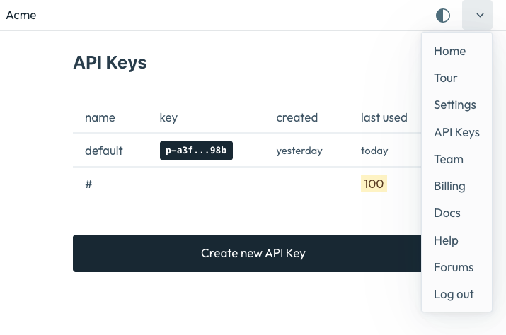
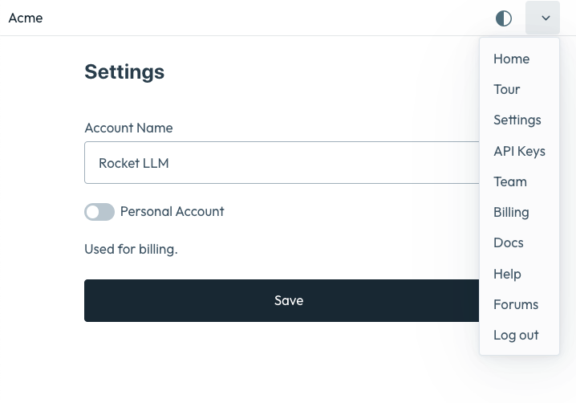
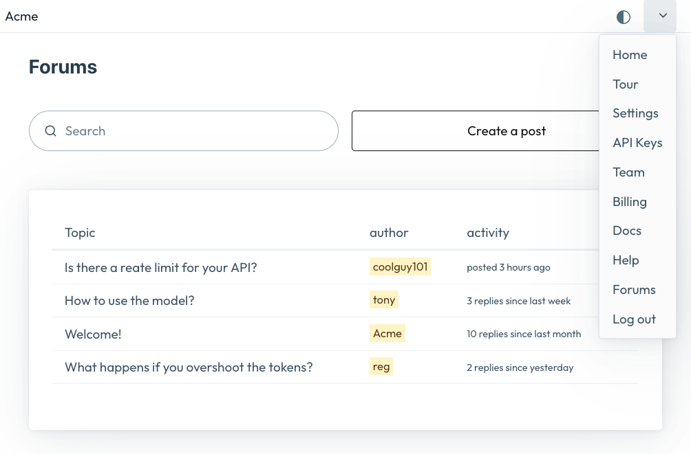

# @softwareasaservice/dashboard

### give your customers a login screen to login to your SaaS
Google Login coming soon.

### Allow customers to invite their teammates
Choose their roles as well

### Allow customers to manage api keys

### Allow users to name their account
And to indicate if for personal use

### Forums included*

### Include a tour*

### Integration

    yarn add @softwareasaservice/dashboard
    

### Navigation your react app will get

# @softwareasaservice/events

### User journey automations 

